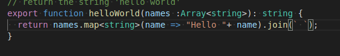

# Task 1
changing the helloWorld function inside simple directory to return "hello <my_name>

# Task 2
Do the samething as we did in task 1, but this time the name is going to give as parametre to helloWorld function.

# Task 3
This time we are going to give a list of names to helloWorld fuction and print the message for each name inside that list.

# Task 4
Here we are going use the Context class function named "predecessor".

