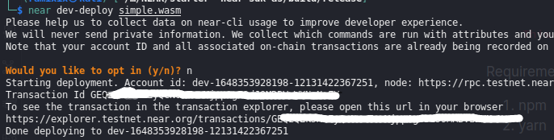
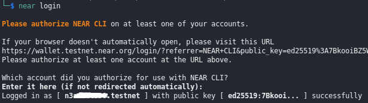
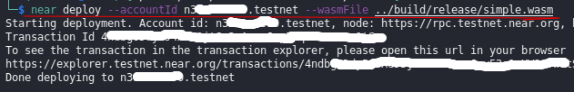
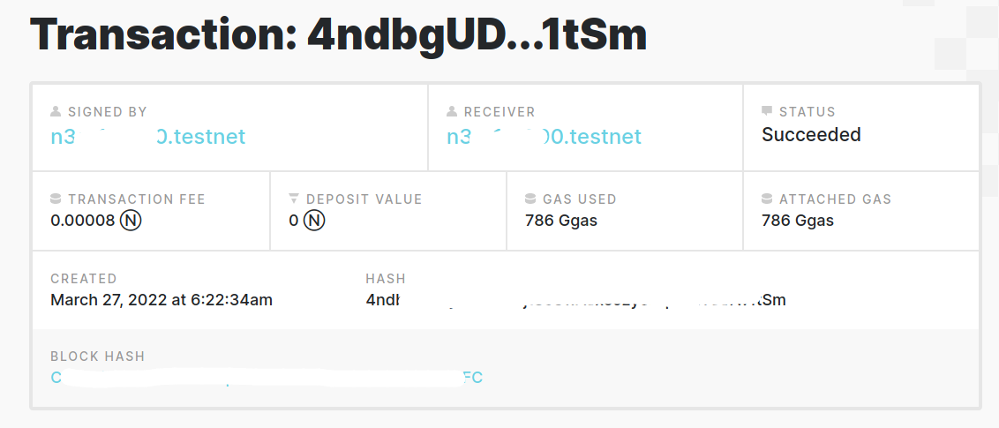

# Near Protocol Web 3.0
		This is a walkthrough for bootcamp web3.0 that is organized by patika.dev

Requirement programs that you better install them before going any further :
1. npm	
2. yarn	
3. git	
4. near-cli		

## What are we tryping to do?
Basically our purpose is to use an existing contract and build some webassembly programs, and at the end deploy this contract to our 'near' account and make a transaction.

To do this we use simple contracts available in here : (https://github.com/Learn-NEAR/starter--near-sdk-as) 

After cloning the github program above and build the ".wasm" files we can deploy them the near protocols using two ways. 

1. The first way is the easist way possible, all to need to deploy a smart contract is to run the commad (ex shown below) : `near dev-deploy <WASM_FILE_PATH>`.
	
	
	
	As you can see we have successfully deployed the contract, you can also see the transaction information in the terminal.
	
2. The second way is to deploy a contract to a specific near account. In order to do this, we must first log into one. You can do this by typing `near login` in the terminal. After typing this command,  a near login-page will immediately open in  and will ask you for your information and permission. By giving the right information and permission you will see the message below in your terminal :
	
	
	
	Now that you are logged in to your account, all you need to deploy a contract to your account is to type the following command  :  `near deploy --accountId <account_name> --wasmFile <WASM_file_path>`
	
	
	
	To see the transaction in the transaction explorere, you can open the give url in your browser. ex :
	
	
	
	
	Read this [article](https://hackmd.io/@d3mage/prepare-for-ncd) for a deeper explanation.